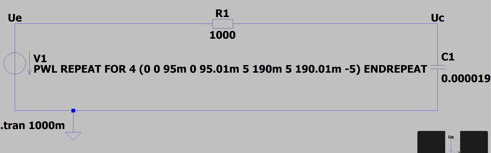
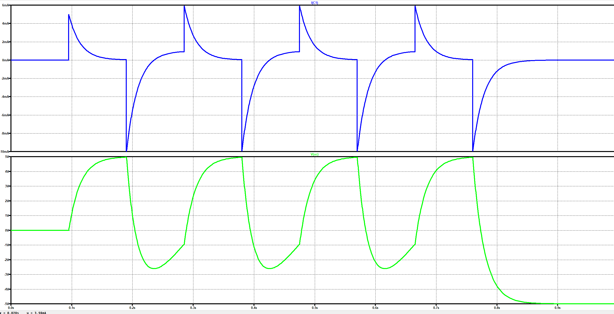

# Simulieren LT Spice

## Aufgabenstellung

Simulieren Sie eine Lade- und Entladekurve (Strom und Spannung) in LT Spice.

Als Eingangssignal nehmen Sie ein Rechtecksignal in geeigneter Frequenz (Anm. T/2 >=5 Tau)

Als Tau nehmen Sie die Ziffernsumme Ihres Geburtsdatums in ms.
Geben Sie ein PDF mit Ihren Berechnungen und den Screenshot Ihrer Schaltung und Simulation ab.
Geben Sie das .asc File ebenso ab.

## Brechnungen

``Geburtsdatum=2002-4-29``

`` R=1kOhm ``

$$ T=2+0+0+2+4+2+9 = 19ms $$

$$ C= T/R $$

$$ C= 19ms/1kOhm $$

$$ C= 19uF $$

## Schaltung



## Simulation



## .asc File

``` asc
Version 4
SHEET 1 1236 680
WIRE 384 128 -32 128
WIRE 896 128 464 128
WIRE -32 176 -32 128
WIRE 896 192 896 128
WIRE -32 320 -32 256
WIRE 96 320 -32 320
WIRE 896 320 896 256
WIRE 896 320 96 320
WIRE 96 368 96 320
FLAG 96 368 0
FLAG -32 128 Ue
FLAG 896 128 Uc
SYMBOL res 480 144 M270
WINDOW 0 26 56 VTop 2
WINDOW 3 6 56 VBottom 2
SYMATTR InstName R1
SYMATTR Value 1000
SYMATTR SpiceLine tol=1 pwr=0.1
SYMBOL voltage -32 160 R0
SYMATTR InstName V1
SYMATTR Value PWL REPEAT FOR 4 (0 0 95m 0 95.01m 5 190m 5 190.01m -5) ENDREPEAT
SYMBOL cap 880 192 R0
SYMATTR InstName C1
SYMATTR Value 0.000019
TEXT -64 352 Left 2 !.tran 1000m
```
